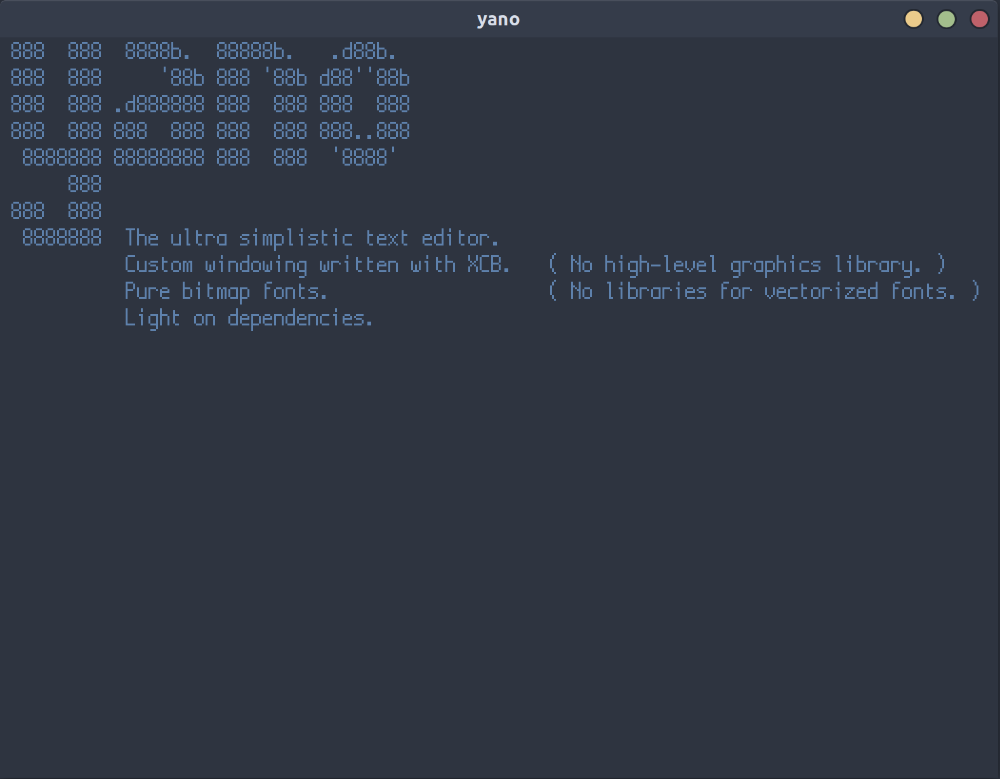

# Yet Another NanO (yano)

Yano is a custom Linux text editor designed to be light on dependencies: only `XCB`, `Xlib`, and basic C/C++ libraries are required.

Structure: 
1. Basic windowing functions (window creation, event polling, redrawing) can be found in `windowing.h`.
2. Functions specific to the text editor can be found in `yano.h`.

## Running yano
A makefile is provided for convenience, so to build yano, simply type `make` from within `src`. To run yano, use `./yano`.

## Configuring yano
yano supports bitmapped fonts in the Adobe `.bdf` file format. By default, yano uses the Boxxy font; if you would like to use a different font, simply move another `.bdf` file into `config/fonts` and run `bdfparser.py` (this requires a Python3 install). This will generate a new set of glyphs that you can configure yano to use from within `yano.h`.